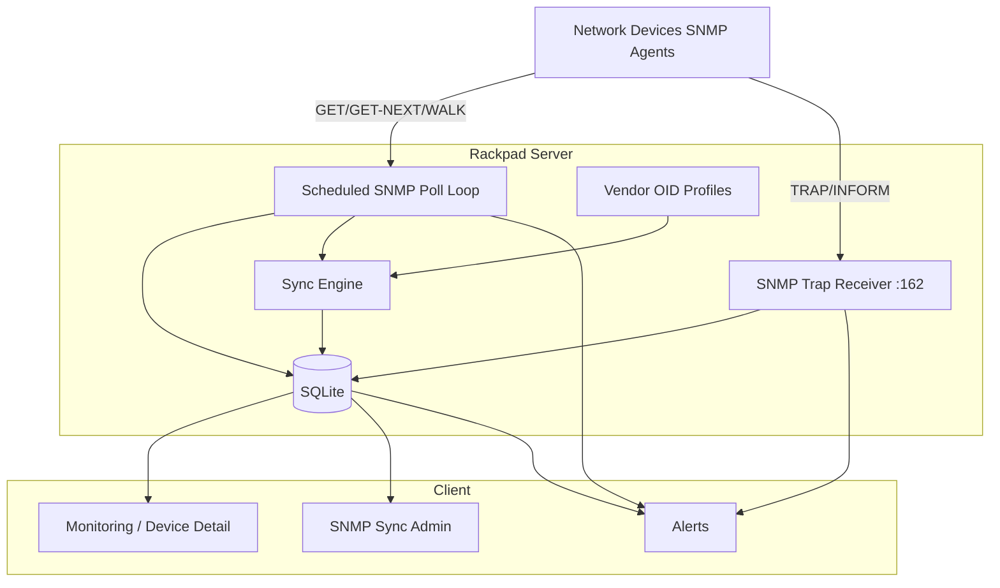

# SNMP Monitoring — Full Implementation Plan

Tracks GitHub issue **#35** and related monitoring/inventory requests.

**Last updated:** 2026-06-10  
**Current baseline:** Rackpad **1.6.1** on `main` — SNMP Phases **1–5 (v1)**
implemented (schema **v23**). Enable inventory sync with
`SNMP_INVENTORY_SYNC=1`.

---

## Shipped in 1.6.x (Phases 1–5 v1)

| Phase    | Theme                                                   | Schema / key paths                                       |
| -------- | ------------------------------------------------------- | -------------------------------------------------------- |
| **1**    | IF-MIB monitors, port linkage, match modes, OID presets | v21 — `server/lib/snmp-match.ts`, `monitoring.ts`        |
| **2**    | SNMPv3 + per-lab encrypted credentials                  | v22 — `server/lib/snmp-v3.ts`, `snmp-credentials.ts`     |
| **3**    | Trap receiver (v1/v2c), trap log, linkUp/Down actions   | v23 — `server/lib/snmp-traps.ts`, `snmp-trap-parser.ts`  |
| **4**    | Port/dashboard/visualizer SNMP verified state           | — `src/lib/snmp-port-status.ts`, port components         |
| **5 v1** | Profile framework + VLAN/subnet sync preview/apply      | — `server/lib/snmp-profiles/`, `server/lib/snmp-sync.ts` |

**Automated tests:** 66 server tests passing (incl. SNMP match, traps, sync diff,
credentials).

---

## Current State (as of 1.6.1)

| Area                              | Status          | Notes                                                     |
| --------------------------------- | --------------- | --------------------------------------------------------- |
| SNMP GET (v1/v2c/v3)              | **Done**        | `server/lib/snmp.ts`, `snmp-v3.ts`                        |
| Monitor type `snmp` + match modes | **Done**        | `any`, `equals`, `notEquals`, `in` (no `regex` yet)       |
| IF-MIB discover / import          | **Done**        | `ifHighSpeed` → port speed when empty; port match preview |
| Monitor ↔ port linkage            | **Done**        | `portId`, `snmpIfIndex`; `syncMonitorPortState()`         |
| Port `linkState` from SNMP        | **Done**        | Poll + trap path; badges in Ports/Dashboard/Visualizer    |
| SNMPv3 + credentials              | **Done**        | Per-lab AES-256-GCM secrets; `RACKPAD_SECRET_KEY`         |
| SNMP traps (UDP)                  | **Done**        | Default **1162**; env `SNMP_TRAP_*`; v1/v2c parse         |
| Trap → monitor / port / alert     | **Done**        | Dedupe 30s; auto-learn IP→device                          |
| Inventory sync (VLAN/subnet)      | **Done (v1)**   | Feature flag `SNMP_INVENTORY_SYNC=1`; merge + mirror      |
| Vendor profiles (generic)         | **Done**        | Q-BRIDGE VLANs, IP-MIB subnets, combined profile          |
| Vendor profiles (pfSense/UniFi/…) | **Not started** | Deferred per product decision                             |
| DHCP scope sync apply             | **Not started** | Preview message only in v1                                |
| Scheduled SNMP / sync cron        | **Not started** | Phase 5.3                                                 |
| Phase 6 (Inform, Prometheus, …)   | **Not started** | See below                                                 |

---

## Outstanding work

Prioritized backlog. Track here until shipped + documented.

### P0 — Close Phase 5 exit criteria & release prep

| Item                             | Phase | Notes                                                                       |
| -------------------------------- | ----- | --------------------------------------------------------------------------- |
| **pfSense / OPNsense profile**   | 5.1   | Host MIBs for subnets + DHCP scope _preview_; first vendor-specific profile |
| **DHCP scope merge apply**       | 5.2   | Add missing scopes only; never silent delete assignments                    |
| **README/admin guide follow-up** | Docs  | Add more trap forwarding examples (pfSense, UniFi, managed switches)        |
| **Update #35 / issue map**       | Docs  | Mark 1.6.x shipped scope vs remaining v3 traps/vendor sync                  |
| **Manual lab matrix**            | Test  | Linux snmpd, one managed switch, pfSense — preview/apply + traps            |

### P1 — Phase 5 remainder

| Item                            | Notes                                                                    |
| ------------------------------- | ------------------------------------------------------------------------ |
| Scheduled sync per device       | Optional interval (e.g. daily merge) on Monitoring or device row         |
| Q-BRIDGE port ↔ VLAN membership | Bridge MIB walk; port `allowedVlanIds` preview (high value for switches) |
| Subnet ↔ VLAN linking on sync   | Tie `ipAdEnt` subnets to Q-BRIDGE VLAN when both profiles run            |
| Mirror policy UX                | Lab-level sync history / last preview snapshot (optional)                |

### P2 — Phase 4 / monitoring polish

| Item                               | Notes                                                                        |
| ---------------------------------- | ---------------------------------------------------------------------------- |
| Bridge MIB / MAU for SFP status    | Phase 4.3 — devices that expose optics OIDs                                  |
| `snmpMatchMode: regex`             | Phase 1.1 — was spec’d, not implemented                                      |
| Structured SNMP poll logging       | Phase 1.4 — timeout/auth failure log lines                                   |
| SNMPv3 **traps**                   | Phase 3 follow-up — v1/v2c traps only today; v3 polling is already supported |
| Bulk “Add SNMP interface monitors” | Multi-device discover/import from Devices list                               |

### P3 — Phase 6 (enterprise & scale)

| Item                                   | Notes                                         |
| -------------------------------------- | --------------------------------------------- |
| SNMP Inform ack                        | Reliable traps                                |
| Bulk polling queue + concurrency limit | Avoid N simultaneous walks                    |
| Per-lab SNMP rate limits               | Protect agents and Rackpad                    |
| Prometheus metrics                     | Poll latency, trap rate, failures             |
| i18n for SNMP UI                       | Monitoring, sync panel, trap log, credentials |

### P4 — Documentation (still open)

- [ ] README: full SNMP setup (community, firewall, Docker `-p 1162:1162/udp`, host networking)
- [ ] Admin guide: trap forwarding examples (pfSense, UniFi)
- [ ] OID cookbook: homelab IF-MIB examples
- [ ] Docker Compose example env block for all `SNMP_*` + `RACKPAD_SECRET_KEY`

### Explicitly deferred (product decisions)

- pfSense/Q-BRIDGE **port membership** in first sync sprint — VLAN names + subnets first ✅ done; port VLAN tagging later
- UniFi / MikroTik / FortiGate profiles — one at a time after pfSense
- YAML/community-contributed profiles in repo — evaluate after first vendor profile ships
- Silent deletes in IPAM sync — blocked; mirror requires `allowDeletes` + dependency checks ✅

---

## Resolved decisions (2026-06)

| #   | Decision                   | Resolution                                                           |
| --- | -------------------------- | -------------------------------------------------------------------- |
| 1   | Credentials scope          | **Per lab** (+ optional per device / per monitor override)           |
| 2   | Trap port default          | **1162** in Docker; document host 162 → container 1162               |
| 3   | First vendor profile       | **Generic Q-BRIDGE + IP-MIB** shipped; **pfSense next**              |
| 4   | Sync scope v1              | **VLANs + subnets** apply; **DHCP preview only** (apply outstanding) |
| 5   | Profile contribution model | **TypeScript profiles in repo** for now; YAML/UI TBD                 |

---

## Recommended next sprint

1. **pfSense/OPNsense profile** — subnets + DHCP scope preview.
2. **DHCP merge apply** — add missing scopes only.
3. **README + CHANGELOG** — ship-ready docs for SNMP bundle.
4. Manual validation on real gear; then tag **2.0.0** candidate.

_(Do not push/release until reviewed — work stays on dev.)_

---

## Vision

Rackpad should support SNMP as a first-class monitoring and (optionally) inventory source:

1. **Poll** device and interface health via standard and vendor OIDs.
2. **Receive traps** for near-real-time link/device events.
3. **Authenticate** with SNMPv3 where v2c is insufficient.
4. **Link** SNMP interfaces to Rackpad ports/devices.
5. **Sync** (optional, profile-driven) VLAN/IPAM data from capable devices.

---

## Current State (legacy checklist — see tables above)

> **Note:** The table at the top of this document is authoritative. Phase sections below retain historical task lists; items not marked `[x]` may still be outstanding — see **Outstanding work**.

---

## Architecture Target

**Design principles**

- Keep SNMP protocol code in `server/lib/snmp*.ts` (no scattered BER logic).
- Treat **IF-MIB** as the universal layer; vendor features as **profiles**.
- Never auto-write VLAN/IPAM without explicit admin opt-in + dry-run preview.
- All SNMP operations run **from the Rackpad server/container** (same as ICMP today).
- Respect **per-lab ACLs** on every new route and sync job.

---

## Phase 1 — Hardening & polish ✅ (dev)

**Goal:** Make existing SNMP polling production-ready before adding traps/v3.

### 1.1 Monitor model extensions

- [x] Add `portId` (nullable FK → `ports.id`) on `deviceMonitors`.
- [x] Add `snmpIfIndex` (nullable integer) for traceability.
- [x] Add `snmpMatchMode`: `any` | `equals` | `notEquals` | `in` ( **`regex` outstanding** ).
- [x] Migration + backup/restore in `server/routes/admin.ts`.

### 1.2 Match logic

- [x] Extend `snmpCheck()` to support `equals`, `in`, `any`, `notEquals`.
- [x] Map IF-MIB operStatus integers to human labels in UI and audit log.

### 1.3 UI improvements

- [x] OID **presets** dropdown: sysUpTime, ifOperStatus, ifAdminStatus, ifHighSpeed.
- [x] Link imported interface monitors to Rackpad **ports** by name/ifIndex heuristic.
- [x] Monitoring page: bulk-run respects lab ACL.
- [x] Fix `canManageMonitoring` → use per-lab editor (not admin-only) for monitor CRUD.

### 1.4 Observability

- [ ] Structured log lines for SNMP timeout / error status / auth failure. **Outstanding**
- [x] Audit events: `monitor.snmp.discover`, `monitor.snmp.import`.

### 1.5 Tests

- [x] Unit tests for match modes, trap parser, sync diff, credentials.
- [x] Integration tests: SNMP responder, trap handling, sync apply (`app.test.ts`).

**Exit criteria:** ✅ Met on dev.

---

## Phase 2 — SNMPv3 ✅ (dev)

**Goal:** Answer #35 comment: support v3 for devices that disable v2c.

### 2.1 Credentials model

- [x] Table `snmpCredentials` + `devices.snmpCredentialId` / monitor override.

### 2.2 Security

- [x] Encrypt SNMP secrets at rest (`server/lib/secret-crypto.ts`, `RACKPAD_SECRET_KEY`).
- [x] Never return passwords in API GET; mask in UI.
- [x] Document `RACKPAD_SECRET_KEY` in README.

### 2.3 Protocol

- [x] USM v3 in `server/lib/snmp-v3.ts` (pure JS).
- [x] authNoPriv and authPriv (MD5/SHA + AES128).

### 2.4 UI

- [x] Device / monitor forms: credential picker.
- [x] “Test SNMP” on credentials panel → GET via credential.

**Exit criteria:** ✅ Met on dev.

---

## Phase 3 — SNMP traps ✅ (dev, v1/v2c)

**Goal:** Real-time link/device events; issue title “traps”.

### 3.1 Trap receiver

- [x] UDP listener — default **1162** (`SNMP_TRAP_PORT`).
- [x] Env: `SNMP_TRAP_ENABLED`, `SNMP_TRAP_PORT`, `SNMP_TRAP_BIND`.
- [x] Parse SNMPv1/v2c traps.
- [x] Dedupe window (30s).
- [ ] SNMPv3 traps. **Outstanding** (after v3 trap PDU work).

### 3.2 Trap → inventory mapping

- [x] Tables `snmpTrapSources`, `snmpTrapLog`.
- [x] Auto-learn source IP → device via `managementIp`.
- [x] linkUp/linkDown OID handling.

### 3.3 Actions on trap

- [x] Update monitors via `recordMonitorResult()`.
- [x] Set port `linkState` when monitor has `portId` / `snmpIfIndex`.
- [x] Alert pipeline + audit log.
- [x] Trap history API + paginated log.

### 3.4 Deployment docs

- [x] Device detail trap forwarding help text.
- [x] Health endpoint includes `snmpTraps` status.
- [ ] Expanded Docker / pfSense / UniFi forwarding guide. **Outstanding** (see Docs)

### 3.5 UI

- [x] Trap log on Monitoring page.
- [x] Device detail trap forwarding help.

**Exit criteria:** ✅ Met on dev (v1/v2c traps).

---

## Phase 4 — Port & interface integration ✅ (dev)

**Goal:** SNMP interface state visible in Ports/Racks, not only Monitoring.

### 4.1 Data flow

- [x] On successful ifOperStatus poll or trap: update `ports.linkState` when `deviceMonitors.portId` set.
- [x] Match by `snmpIfIndex` when `portId` is unset.
- [x] Dashboard / Ports views show “SNMP verified” badge.
- [x] Visualizer: optional edge styling from SNMP-verified links.

### 4.2 Smarter port matching

- [x] Import flow: match `ifName` / `ifDescr` to Rackpad port `name` (fuzzy + manual confirm UI).
- [x] Store `ports.snmpIfIndex` for stable re-sync.
- [x] Discover preview shows matched Rackpad port name.

### 4.3 Walk enhancements

- [x] Optional `ifHighSpeed` → port `speed` field on import (when empty).
- [ ] Bridge MIB / MAU for SFP status (devices that support it).

**Exit criteria:** ✅ Met on dev.

---

## Phase 5 — Vendor profiles & inventory sync 🟡 (v1 on dev; exit criteria not met)

**Goal:** Optional auto-maintain VLANs/IPAM (firewall/switch/router); highest value, highest risk.

> **Exit criteria gap:** Plan called for a **vendor-specific** profile (e.g. pfSense). Only **generic Q-BRIDGE + IP-MIB** profiles shipped in v1. See **Outstanding work → P0**.

### 5.1 Profile framework

- [x] `server/lib/snmp-profiles/` — one file per vendor family.
- [x] Profile schema with collectors for VLANs/subnets.
- [x] Built-in profiles:
  1. **Generic IF-MIB** (Phase 1–4 interface monitors)
  2. **Q-BRIDGE-MIB** (`q-bridge-vlans`)
  3. **IP-MIB subnets** (`ip-adent-subnets`)
  4. **Combined** (`standard-l2-l3`)
  5. pfSense / OPNsense — deferred
  6. UniFi / MikroTik / FortiGate — deferred

### 5.2 Sync engine

- [x] `POST /api/snmp-sync/preview` — dry-run diff for VLANs/subnets.
- [x] `POST /api/snmp-sync/apply` — admin-only, lab-scoped, with conflict policy:
  - `merge` — add missing only
  - `mirror` — create/update/delete with `allowDeletes` confirmation
- [x] Never delete subnets with IP assignments (blocked in preview/apply).
- [ ] DHCP scope apply (preview-only message in v1).

### 5.3 UI

- [x] Device → Monitoring tab → SNMP inventory sync panel.
- [ ] Scheduled sync (cron): optional interval per device (e.g. daily).

### 5.4 Safety

- [x] All sync writes audited.
- [x] Rollback = restore from admin backup (existing feature).
- [x] Feature flag: `SNMP_INVENTORY_SYNC=1`.

**Exit criteria:** ❌ Not met — pfSense (or equivalent) profile + confirmed manual lab run still required.

---

## Phase 6 — Enterprise & scale (not started)

- [ ] SNMP **Inform** ack support (reliable traps).
- [ ] Bulk polling queue with concurrency limit (avoid N× simultaneous walks).
- [ ] Per-lab SNMP rate limits.
- [ ] Metrics export (Prometheus): poll latency, trap rate, failures.
- [ ] i18n for all new SNMP UI strings (342+ key pattern).

---

## Suggested release mapping

| Release   | Phases  | Theme                                       | Status                                          |
| --------- | ------- | ------------------------------------------- | ----------------------------------------------- |
| **1.6.0** | Phase 1 | Interface monitors + port linkage + presets | ✅ On dev, unreleased                           |
| **1.7.0** | Phase 2 | SNMPv3                                      | ✅ On dev, unreleased                           |
| **1.8.0** | Phase 3 | Trap receiver + alerts                      | ✅ On dev, unreleased                           |
| **1.9.0** | Phase 4 | Ports/visualizer integration                | ✅ On dev, unreleased                           |
| **2.0.0** | Phase 5 | pfSense or full sync + docs                 | 🟡 v1 on dev; vendor profile + docs outstanding |

Adjust based on user demand; traps and v3 can be swapped if community prioritizes v3 first.

---

## Dependencies & risks

| Risk                                      | Mitigation                                             |
| ----------------------------------------- | ------------------------------------------------------ |
| Docker non-root cannot bind 162           | Default 1162 + doc port mapping                        |
| SNMP from container can’t reach mgmt VLAN | Doc host networking / macvlan; same as ICMP today      |
| Vendor MIBs undocumented                  | Start IF-MIB + Q-BRIDGE; profiles contributed via JSON |
| Sync destroys manual IPAM                 | Preview-only default; merge mode; no auto-delete v1    |
| SNMPv3 crypto complexity                  | Phase 2 scoped to authNoPriv + AES128 authPriv         |
| Secret storage                            | Instance encryption key; document backup implications  |

---

## Testing strategy

1. **Unit:** BER encode/decode, walk termination, OID parsing, match modes.
2. **Integration:** In-process UDP SNMP responder (existing pattern in `app.test.ts`).
3. **Fixtures:** Recorded PCAP or hex payloads for trap parsing regression tests.
4. **Manual lab matrix:** Linux (snmpd), pfSense, one managed switch, one UniFi/AP if applicable.
5. **CI:** No live network; all automated tests use mock responders.

---

## Documentation deliverables

- [x] README env vars: `RACKPAD_SECRET_KEY`, `SNMP_TRAP_*`, `SNMP_INVENTORY_SYNC` (partial).
- [ ] README section: full SNMP monitoring setup (community, firewall, Docker ports). **Outstanding**
- [ ] Admin guide: trap forwarding, v3 credentials, sync preview. **Outstanding**
- [ ] OID cookbook: common IF-MIB examples for homelab gear. **Outstanding**
- [ ] Update `docs/BETA_1_5_ISSUE_MAP.md` #35 when phases ship. **Outstanding**
- [ ] CHANGELOG entries per release. **Outstanding**

---

## Open decisions

All previously open items are **resolved** — see **Resolved decisions (2026-06)** above. New decisions for next sprint:

1. **pfSense vs UniFi** as first vendor-specific profile (recommend pfSense).
2. **Release cadence:** single 2.0.0 bundle vs incremental 1.6–1.9 tags on dev.
3. **Scheduled sync:** device-level vs lab-level cron.

---

## Related issues

- **#35** — SNMP monitoring and traps (primary)
- **#28** — Services per device (SNMP could populate service list later)
- **#34** — WiFi port type (orthogonal; possible future wireless MIB)
- Monitoring bulk actions — extend to “Add SNMP interface monitors” for selected devices
